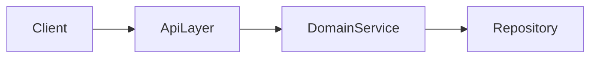
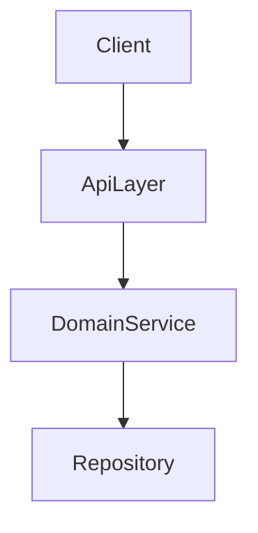
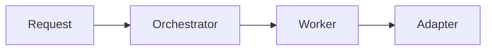

# Plan Architecture

## Overview

这个 skill 负责收敛总体架构与核心架构逻辑。它可以承接需求文档，也可以独立用于重构、架构梳理和模块边界调整。

## When to Use

在这些场景使用：
- 已有需求文档，需要进一步设计总体架构和核心逻辑
- 用户想做重构、架构梳理、模块边界重建
- 需要结合当前代码现状判断方案边界和技术折中
- 还不该进入任务拆解，但已经需要明确“怎么组织系统”

不要在这些场景使用：
- 需求目标、边界、成功标准还明显不稳：先用 `plan-req`
- 用户已经明确要文件级步骤、测试命令和执行顺序：改用 `writing-plans`

## Input Rules

输入优先级：
1. 用户明确指定的需求文档 / 架构文档路径
2. 当前对话中已确认的信息
3. 当前代码现状与已有模式

有文档先用文档；没有就用对话，不要强制要求正式文档。

## Core Rules

1. 只解决这些问题：
   - 总体技术路线
   - 模块职责与边界
   - 核心调用链 / 数据流
   - 关键技术折中
   - 当前代码约束下的现实方案
   - 主要风险与假设

2. 不要下沉到这些内容：
   - 文件路径
   - 逐步实现计划
   - 测试命令
   - commit 粒度
   - 里程碑/阶段拆分
   - 函数级/方法级细节设计（除非用户明确要求）

3. 优先复用当前代码现实，不为了“更优雅”强行引入新抽象。

4. 如果发现的是需求问题，不要悄悄吞进架构结论；先判断是否需要需求回流。

5. 当前阶段无法闭环但后续容易遗漏的问题，记录到 `Deferred for Later Stages`。

## Demand Feedback Loop

架构阶段想到需求变化时，按三类处理：

### 轻度回流：澄清型
- 只是补充说明，不改变目标、范围或成功标准
- 直接回写需求文档或需求摘要后继续

### 中度回流：决策型
- 影响关键业务规则或关键约束
- 暂停当前架构点，回到需求阶段补充决策，再继续

### 重度回流：范围变更型
- 改变目标、范围或成功标准
- 终止当前架构版本，重新做需求收敛

原则：架构阶段可以发现需求问题，但不能在未更新上游需求输入前私自吸收需求变更。

## Output Contract

产出文档应聚焦架构层，建议结构如下：

```md
# Architecture Brief

## Requirement Summary
## Current Codebase Reality
## Architecture Options
## Recommended Architecture
## Key Architecture Diagram
## Module Boundaries
## Core Flow / Data Flow
## Key Trade-offs
## Risks
## Assumptions

## Deferred for Later Stages

### For Requirements
### For Planning
### For Implementation
```

要求：
- `Requirement Summary` 只摘要当前有效需求，不重新发明需求；如果发现需求变化，先通过需求回流更新上游输入，再更新此摘要
- `Current Codebase Reality` 必须基于真实代码现状，不做空中设计
- `Architecture Options` 只在存在两个及以上可行架构方向时出现；每个选项应写清适用前提、核心结构、主要收益与主要代价
- `Recommended Architecture` 只保留最终建议方案，不把未拍板候选混写进去
- `Key Architecture Diagram` 默认提供一个最适合当前问题的关键结构图，帮助读者快速理解系统组织方式与核心差异
- `Deferred for Later Stages` 只保留未解决项

## Diagram Rules

1. 默认输出 `Key Architecture Diagram`，但图的类型必须根据问题本身选择，不要机械固定为类图。
2. 优先选择最能表达当前重点的图：
   - 表达静态职责、接口与依赖关系：类图 / 组件图
   - 表达模块分层与边界：分层图 / 组件图
   - 表达请求路径、调用链、控制流：时序图 / 流程图
   - 表达数据在系统间流转：数据流图 / 流程图
   - 表达多架构候选之间的结构差异：每个候选方案各自使用最合适的图，不要求图种一致，但必须可直接对比
3. 图的目标是帮助理解，不是追求完整映射；宁可少而准，也不要大而散。
4. 如果当前讨论的是多架构选型：
   - 先在 `Architecture Options` 中逐项描述方案
   - 再为每个候选方案分别给出一个小型关键结构图
   - 最后补一个 `Comparison Summary`，明确结构差异点，尤其是职责归属、依赖方向、扩展点位置、状态流转方式和复杂度来源
5. 如果最终推荐方案与当前代码现实差距较大，要在图后补一句迁移视角说明，指出是“目标结构”还是“现状抽象”。
6. 图优先使用 Mermaid，按表达需要选择 `classDiagram`、`flowchart`、`sequenceDiagram` 等合适语法，保证可直接嵌入 markdown。

推荐模板：

```md
## Key Architecture Diagram

- 图类型：组件图
- 选择原因：当前重点是说明模块边界与依赖方向


```

多架构对比模板：

```md
## Architecture Options

### Option A
- 适用前提：...
- 核心结构：...
- 主要收益：...
- 主要代价：...
- 图类型：分层/组件图



### Option B
- 适用前提：...
- 核心结构：...
- 主要收益：...
- 主要代价：...
- 图类型：协调/调用流图



### Comparison Summary
- 职责归属差异：...
- 依赖方向差异：...
- 扩展点差异：...
- 状态或控制流差异：...
- 复杂度来源差异：...
```

## Deferred Rules

适合进入 deferred 的问题：
- 当前阶段无法可靠定版
- 继续讨论收益低
- 应由需求或 planning 阶段负责
- 后续若不记录容易遗漏

不要记录：
- 已经拍板的问题
- 为未来预留的纯扩展想法
- 已经进入实施粒度的碎问题

## Common Mistakes

- 还没确认需求边界，就提前下总体架构结论
- 用理想架构替代当前代码现实
- 架构讨论直接滑进文件拆分和任务步骤
- 把需求变更偷偷吸收到架构文档里，导致上游真相源失效
- 把 deferred 当作想法停车场，塞入大量无优先级的问题
- 不看问题类型，机械套用同一种图，导致图和架构重点错位
- 把图画成代码全量镜像，导致读者无法快速看出关键结构
- 多架构讨论只写文字优缺点，不展示结构差异，导致比较停留在口号层

## Handoff

完成后：
- 如果仍需补稳定需求输入：回到 `plan-req`
- 如果总体架构已经明确，要进入落地：使用 `writing-plans`

`plan-arch` 可以作为独立 skill 使用，不依赖固定顺序。
